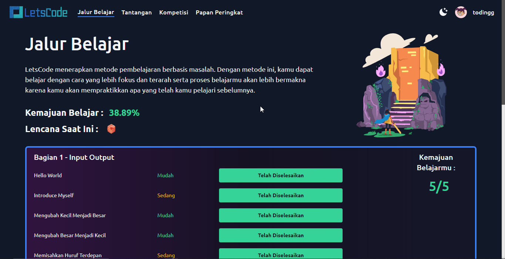
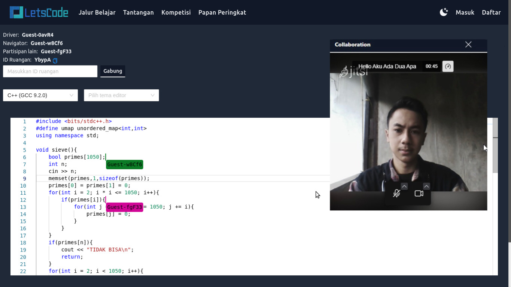

# LetsCode

LetsCode is a web-based application designed to assist in learning basic programming. In LetsCode, basic programming learning material is presented in the form of problems that must be solved together by the learning pair (implementation of distributed pair programming). The application allows users to learn the basics of programming in an interactive and enjoyable way.


## Preview




## Demo

Try LetsCode here  
- https://letscode.wildanzr.my.id
- https://letscode.emwrks.com


## Installation

<b>This installation guide is tested on Ubuntu 20.04. Please note that Judge0 is currently not working on Ubuntu 22.04. If you use another operating system, you may need to make some adjustments. Please read the official documentation for more information.
- https://judge0.com/
- https://github.com/judge0/judge0
- https://docs.docker.com/engine/install/
</b>

To install LetsCode, make sure you have installed Docker on system. Docker is a platform for running and managing containers, which are lightweight and portable units that encapsulate an application and its dependencies.

Once Docker is installed, follow these steps to install LetsCode:  

1. Create an `.env` file:
    - Create a new file named `.env` in the same directory as your `.env.sample` file.
    - Copy the contents of the `.env.sample` file (or you can copy .env.sample to .env) 
    - Replace the placeholders with the actual values that you want to use.
    - Save the `.env` file.

2. Go to fe directory and create an `.env` file:
    - Create a new file named `.env` in the same directory as your `.env.sample` file. (make sure you are in fe directory)
    - Copy the contents of the `.env.sample` file (or you can copy .env.sample to .env) 
    - Replace the placeholders with the actual values that you want to use.
    - Save the `.env` file.

3. Build the application with Docker Compose:
    - Open a terminal or command prompt in the same directory as your `docker-compose.yml` file.
    - Run the command `docker-compose build`. This will build all the Docker images defined in the `docker-compose.yml` file.

4. Run the application with Docker Compose:
    - In the terminal or command prompt, run this command
    ```
    docker-compose up -d db redis rabbitmq
    sleep 10
    docker-compose up -d
    ```
    - You can see the log of containers by executing the command `docker logs letscode-nameofimage`

## 🚀 Features

- Support up to 60 programming languages
- Execute code in the browser
- Collaborative code playground (realtime share and edit code)
- Video call
- Points, badge, and leaderboard system
- Learning journey, challenge, and competition system
- Light/dark mode toggle
- Cross platform